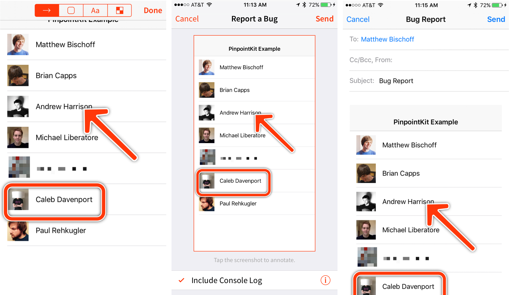

[](https://dashboard.buddybuild.com/apps/588239a8711a3f0100b86836/build/latest?branch=master)
[](https://img.shields.io/cocoapods/v/PinpointKit.svg)
[](https://github.com/Carthage/Carthage)

**PinpointKit** is an open-source iOS library in Swift that lets your testers and users send feedback with annotated screenshots using a simple gesture.



<!-- TOC depthFrom:2 depthTo:6 withLinks:1 updateOnSave:1 orderedList:0 -->

- [Features](#features)
- [Requirements](#requirements)
- [Installation](#installation)
	- [CocoaPods](#cocoapods)
	- [Carthage](#carthage)
	- [Manually](#manually)
		- [Embedded Framework](#embedded-framework)
- [Usage](#usage)
- [Customization](#customization)
- [License](#license)
- [About](#about)

<!-- /TOC -->

## Features

- [x] Shake to trigger feedback collection
- [x] Add arrows, boxes, and text to screenshots to point out problems.
- [x] Blur our sensitive information before sending screenshots
- [x] Automatic, opt-in system log collection ([iOS 9.x only](https://github.com/Lickability/PinpointKit/blob/master/PinpointKit/PinpointKit/Sources/Core/SystemLogCollector.swift#L30))
- [x] Customize everything
	- [x] The color of the arrows, and boxes
	- [x] The text in the interface
	- [x] How and where your feedback is sent
- [x] Absolutely free and open source
- [x] No backend required

## Requirements

* iOS 9.0+
* Xcode 8.0+
* Swift 3.0
	* Looking for a Swift 2.3 version? See the [README](https://github.com/Lickability/PinpointKit/blob/swift-2.3/README.md) on the [`swift-2.3`](https://github.com/Lickability/PinpointKit/tree/swift-2.3) branch.

> **Note:** [`ScreenshotDetector`](https://github.com/Lickability/PinpointKit/blob/master/PinpointKit/PinpointKit/Sources/ScreenshotDetector/ScreenshotDetector.swift) depends on the `Photos` framework to access the user’s photo library. This requires you to add an entry for the [`NSPhotoLibraryUsageDescription`](https://developer.apple.com/library/content/documentation/General/Reference/InfoPlistKeyReference/Articles/CocoaKeys.html#//apple_ref/doc/uid/TP40009251-SW17) key in your `Info.plist` file describing your app’s use of the user’s photo library. As of iOS 10, failure to provide a value for this key could cause your submission to the App Store to be rejected by Apple, or cause your app to exit upon attempting to access the user’s photo library. [`ScreenshotDetector`](https://github.com/Lickability/PinpointKit/blob/master/PinpointKit/PinpointKit/Sources/ScreenshotDetector/ScreenshotDetector.swift) is excluded by default when installing via CocoaPods, but is included otherwise.

## Installation

### CocoaPods

[CocoaPods](http://cocoapods.org) is a dependency manager for Cocoa projects. You can install it with the following command:

```bash
$ gem install cocoapods
```

> CocoaPods 1.0.0+ is required to build PinpointKit.

To integrate PinpointKit into your Xcode project using CocoaPods, specify it in your `Podfile`:

```ruby
source 'https://github.com/CocoaPods/Specs.git'
platform :ios, '9.0'
use_frameworks!

target 'YOUR_TARGET_NAME' do
    pod 'PinpointKit', '~> 1.0'
end

```

Then, run the following command:

```bash
$ pod install
```

We also offer a convenience class, [`ScreenshotDetector`](https://github.com/Lickability/PinpointKit/blob/master/PinpointKit/PinpointKit/Sources/ScreenshotDetector/ScreenshotDetector.swift) that is available via the `ScreenshotDetector` subspec. This class provides delegate callbacks when the user takes a screenshot while using your app. Please see the [Requirements](#requirements) section regarding inclusion of [`ScreenshotDetector`](https://github.com/Lickability/PinpointKit/blob/master/PinpointKit/PinpointKit/Sources/ScreenshotDetector/ScreenshotDetector.swift). You can add this to your project by adding the following line in your `Podfile`, in addition to the one for `PinpointKit` above:

```ruby
pod 'PinpointKit/ScreenshotDetector', '~> 1.0'
```

### Carthage

[Carthage](https://github.com/Carthage/Carthage) is a decentralized dependency manager that builds your dependencies and provides you with binary frameworks.

You can install Carthage with [Homebrew](http://brew.sh/) using the following command:

```bash
$ brew update
$ brew install carthage
```

To integrate PinpointKit into your Xcode project using Carthage, specify it in your `Cartfile`:

```ogdl
github "Lickability/PinpointKit" ~> 1.0
```

- Run `carthage update` to build the framework.
- Next, select your application project in the Project Navigator (blue project icon) to navigate to the target configuration window and select the application target under the “Targets” heading in the sidebar.
- In the tab bar at the top of that window, open the “General” panel.
- Drag the built `PinpointKit.framework` from the Carthage build folder into the “Embedded Binaries” section.

### Manually

If you prefer not to use either of the aforementioned dependency managers, you can integrate PinpointKit into your project manually.

#### Embedded Framework

- Open up Terminal, `cd` into your top-level project directory, and run the following command if your project is not initialized as a git repository:

```bash
$ git init
```

- Add PinpointKit as a git [submodule](http://git-scm.com/docs/git-submodule) by running the following command:

```bash
$ git submodule add -b master https://github.com/Lickability/PinpointKit.git
```

- Open the new `PinpointKit/PinpointKit` folder, and drag the `PinpointKit.xcodeproj` into the Project Navigator of your application’s Xcode project.

    > It should appear nested underneath your application’s blue project icon. Whether it is above or below all the other Xcode groups does not matter.

- Select the `PinpointKit.xcodeproj` in the Project Navigator and verify the deployment target matches that of your application target.
- Next, select your application project in the Project Navigator (blue project icon) to navigate to the target configuration window and select the application target under the “Targets” heading in the sidebar.
- In the tab bar at the top of that window, open the “General” panel.
- Click on the `+` button under the “Embedded Binaries” section.    
- You will see two different `PinpointKit.xcodeproj` folders each with two different versions of the `PinpointKit.framework` nested inside a Products folder.
- Select the top `PinpointKit.framework` for iOS.

- And that’s it!

The `PinpointKit.framework` is automatically added as a target dependency, linked framework and embedded framework in a “Copy Files” build phase which is all you need to build on the simulator and a device.

## Usage

Once PinpointKit is installed, it’s simple to use.

Initialize an instance of [`PinpointKit`](https://github.com/Lickability/PinpointKit/blob/master/PinpointKit/PinpointKit/Sources/Core/PinpointKit.swift), specifying an array of feedback recipients used to pre-populate email addresses to which feedback can be sent:

```swift
let pinpointKit = PinpointKit(feedbackRecipients: ["feedback@example.com"])
```

To display a feedback view controller, add the following code where you want the feedback to display, passing the view controller from which [`PinpointKit`](https://github.com/Lickability/PinpointKit/blob/master/PinpointKit/PinpointKit/Sources/Core/PinpointKit.swift) should present:

```swift
pinpointKit.show(from: viewController)
```
> **Note:** Be sure to keep a strong reference to your instance of [`PinpointKit`](https://github.com/Lickability/PinpointKit/blob/master/PinpointKit/PinpointKit/Sources/Core/PinpointKit.swift) for the duration of its use.

If you want to have the feedback view display from a shake gesture, simply add the following to your application delegate, replacing `["feedback@example.com"]` with your array of email recipients and `AppDelegate` with your application delegate’s name:

```swift
private static let pinpointKit = PinpointKit(feedbackRecipients: ["feedback@example.com"])
var window: UIWindow? = ShakeDetectingWindow(frame: UIScreen.main.bounds, delegate: AppDelegate.pinpointKit)
```

If you don’t want to use [`PinpointKit`](https://github.com/Lickability/PinpointKit/blob/master/PinpointKit/PinpointKit/Sources/Core/PinpointKit.swift)’s default configuration, you can specify both [`Configuration`](https://github.com/Lickability/PinpointKit/blob/master/PinpointKit/PinpointKit/Sources/Core/Configuration.swift) and [`PinpointKitDelegate`](https://github.com/Lickability/PinpointKit/blob/master/PinpointKit/PinpointKit/Sources/Core/PinpointKit.swift) instances on initialization of [`PinpointKit`](https://github.com/Lickability/PinpointKit/blob/master/PinpointKit/PinpointKit/Sources/Core/PinpointKit.swift).

The [`Configuration`](https://github.com/Lickability/PinpointKit/blob/master/PinpointKit/PinpointKit/Sources/Core/Configuration.swift) struct allows you to specify how the feedback view looks and behaves, while the [`PinpointKitDelegate`](https://github.com/Lickability/PinpointKit/blob/master/PinpointKit/PinpointKit/Sources/Core/PinpointKit.swift) instance provides hooks into the state of the feedback being sent.

## Customization

PinpointKit uses a protocol-oriented architecture which allows almost everything to be customized. Here are some examples of what’s possible:

* Implement a `JIRASender` that conforms to [`Sender`](https://github.com/Lickability/PinpointKit/blob/master/PinpointKit/PinpointKit/Sources/Core/Sender.swift), allowing users to send feedback directly into your bug tracker.
* Supply your own console log collector that aggregates messages from your third-party logging framework of choice by conforming to [`LogCollector`](https://github.com/Lickability/PinpointKit/blob/master/PinpointKit/PinpointKit/Sources/Core/LogCollector.swift)
* Change how logs are viewed by creating your own view controller conforming to [`LogViewer`](https://github.com/Lickability/PinpointKit/blob/master/PinpointKit/PinpointKit/Sources/Core/LogViewer.swift).

For more information on what you can customize, take a peek at the documentation of [`Configuration`](https://github.com/Lickability/PinpointKit/blob/master/PinpointKit/PinpointKit/Sources/Core/Configuration.swift).

## Apps Using PinpointKit

Here are just a few of the apps and companies using PinpointKit to collect feedback. If your app does too, submit a pull request!

* [Pinpoint](https://itunes.apple.com/us/app/pinpoint-mark-up-screenshots/id669858907?mt=8) (of course)

## License

PinpointKit is available under the MIT license. See the [`LICENSE`](LICENSE) file for more information.

## About

[](http://lickability.com)

PinpointKit is built and maintained by [Lickability](http://lickability.com), a small software studio in New York that builds apps for clients and customers. If you or your team need help building or updating an app, say [hello@lickability.com](mailto:hello@lickability.com). We’d love to hear more about your project.

Huge thanks to our other [contributors](https://github.com/Lickability/PinpointKit/graphs/contributors), including [Kenny Ackerson](https://twitter.com/pearapps), [Paul Rehkugler](https://twitter.com/paulrehkugler), and [Caleb Davenport](https://twitter.com/calebd).
